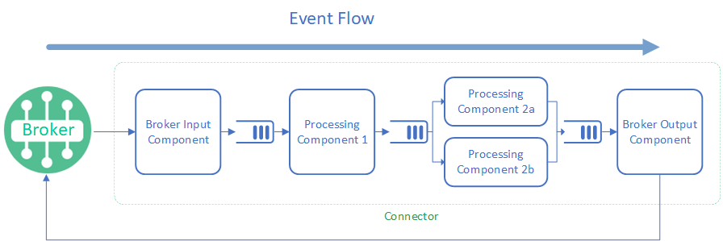

# AI Event Connector for Solace event brokers - Overview

- [AI Event Connector for Solace event brokers - Overview](#ai-event-connector-for-solace-event-brokers---overview)
  - [Architecture](#architecture)
    - [Apps](#apps)
    - [Components](#components)
    - [Built-in Components](#built-in-components)
  - [Configuration](#configuration)
  - [Extensibility](#extensibility)
  - [Resilience and Fault Tolerance](#resilience-and-fault-tolerance)
  - [Scalability](#scalability)

The AI Event Connector makes it easy to connect your AI/ML models to Solace event brokers. It provides a simple way to build pipelines that consume events from Solace, process them with your models, and then publish the results back to Solace. By doing this, you can greatly enhance the value of your event-driven architecture by adding AI capabilities to your event-driven applications.

This connector is built using Python and the Solace Python API. It also heavily leverages LangChain, a Python library for abstracting the interface to many AI models. This allows you to easily swap out different AI models and model providers without having to change your pipeline.

While the connector is built to support extensibility through custom plugins, for most cases you can use the connector as-is with the appropriate configuration for your application.

## Architecture

Each AI Event Connector instance is made up of one or more applications (apps), each containing one or more pipelines of components, called flows. Each flow will always have a single input component, some number of processing components, and a single output component. The input and output components can interface with Solace brokers or possibly connect to other data sources or sinks. The processing components are typically AI models, but can be any kind of processing that you want to do on the data.

Each component in the flow is a separate thread that reads from a queue, processes the event, and then writes the result to the next queue. It will only handle one message at a time, blocking until it has completed processing. As shown below, if higher throughput is needed, you can scale the number of instances of a component to handle more messages in parallel.

Each flow will keep track of the events flowing through them and as they complete processing they will alert the source that the event can be acknowledged. This allows the source to know when the event has been processed and can be removed from the queue. This end-to-end event management ensures that no events are lost and that the system is resilient to failures.

As shown in the diagram above, each flow has a sequence of components with a queue in between each component. The queues are used to buffer the events as they flow through the system and allow for better parallel processing. Also, each stage in the flow can be scaled independently to have multiple instances of the same component running in parallel. This can help balance the load to avoid bottlenecks in the system. Note that if parallel components are used, the order of the events may not be preserved.

### Apps

Apps are logical groupings of flows that serve a common purpose. Each app can contain multiple flows, and each flow can have its own configuration. This allows you to organize your flows into logical groups and manage them together. For example, you might have an app for processing customer inquiries and another app for processing product recommendations.

Apps can be configured with their own settings, such as the number of instances to run. When a component within an app calls `get_config`, it will first check its own configuration for the key, and if it is not found, it will check the app configuration.

For backward compatibility, if your configuration doesn't include an `apps` section, the connector will automatically create an app to contain the flows in your configuration. If the configuration came from a YAML file, the app name will be the name of the file without the extension. If there are multiple files, each file will be treated as a separate app.

### Components

As shown in the flow diagram above, each flow is comprised of a sequence of components. Each component is a separate thread that reads from a queue, processes the event, and then writes the result to the next queue. The diagram below illustrates the pieces that make up a component.

The component is made up of the following parts:

- **Input Queue**: This is a python built queue that the component reads from. It is where the events are buffered as they flow through the system. Note that if there are multiple instances of the same component, they will all read from the same queue.

- **Input Transforms**: This is an optional step that allows you to transform the event before it is processed. This can be useful for normalizing the data or for adding additional context to the event. In the yaml config file this is indicated by the **`input_transforms`** key.

- **Input Selection**: This selects what data should be processed by the component. The data selected should conform to the input schema of the component. It is normal to use Input Transforms and Input Selection together to ensure that the data is in the correct format for the component. If the Input Selection configuration is omitted, the component will select **"previous" as the default**, which will take the exact output of the previous component in the flow as the input to this component. In the yaml config file this is indicated by the **`input_selection`** key.

- **Processing**: This is where the actual processing of the event happens, such as where the AI model would be called to process the event. This is the only required part of the component. In the yaml config file this is controlled by the **`component_module`** and **`component_config`** keys.

After these steps, the component will write the result to the next component's queue. The data written should conform to the output schema of the component. Some components are output components and will send the data to a Solace broker or other data sink.

### Built-in Components

In addition to the standard components, there are a series of other built-in components that can be used to help process events. You can find a list of all built-in components in the [Components](components/index.md) section.

## Configuration

The AI Event Connector is highly configurable. You can define the apps, flows, components, queue depths, and the number of instances of each component. The configuration is done through a YAML file that is loaded when the connector starts. This allows you to easily change the configuration without having to modify the code.

Detailed information on the configuration options can be found in the [Configuration](configuration.md) section.

## Extensibility

The AI Event Connector is designed to be extensible. You can create custom components and add them to your flows. This allows you to add custom processing to your pipelines, such as data transformation, filtering, or aggregation. You can also create custom input and output components to interface with different data sources and sinks.

## Resilience and Fault Tolerance

The AI Event Connector is designed to be resilient and fault-tolerant. It uses queues to buffer events, which allows it to handle temporary spikes in load. It also uses acknowledgements to ensure that events are not lost if the connector fails. If the input component receives messages from an event broker with persistent messaging, the messages are only acknowledged after the event has been fully processed by the flow. Errors thrown while processing a flow, can be handled using the [ErrorInput component](components/error_input.md).

## Scalability

The AI Event Connector is designed to be scalable. You can increase the number of instances of a component to handle more load. This allows you to scale your pipelines to handle more events and process them faster. Additionally, you can run multiple flows or even multiple connectors that connect to the same broker queue to handle more events in parallel. Note that for Solace broker queues, they must be configured to be non-exclusive to have multiple flows receive messages.

---

Checkout [Getting Started](getting_started.md) next.
