# Adding a simplified mode for apps 

We are adding a new mode of running an app that would make it much simpler to build a simple app that is basically one component. 

We will define an app without any flows and just have configuration for the app that define how it will interact with Solace brokers. In its config, there will be a broker config that contains the usual SOLACE_ config and it will also contain input_enabled, output_enabled and request_reply_enabled. For request_reply, it is indicating that during processing it may need to send a request to a broker and wait for a reply. 

The app will automatically create a flows similar to what would be done now where it can receive from the broker and send to the broker. The app will be able to specify a queue name and a list of subscriptions. Each subscription can have an optional component that will be called when a message is received matching that subscription.  

input_enabled will indicate that the app will receive messages from the broker. It will create a flow to receive messages from the broker and send them to the app input queue. The app can then process these messages in its own way.
output_enabled will indicate that the app will send messages to the broker. It will create a flow to send messages from the app output queue to the broker. The app can then send messages to the broker in its own way.
request_reply_enabled will indicate that the app will send messages to the broker and wait for a reply. Part of this will be creating a dedicated response queue with a subscription to the response topic. 

This will be worked into the existing app framework and will be a new mode of running an app. Care should be taken to make the configuration as clean and simple as possible. When the app is running, it should behave very similarly to how it does now, but the app developer will not have to worry about creating flows or managing them. 

## Clarifying questions

1.  **Processing Logic Definition:**
    *   How will the user define the core processing logic for a simplified app? Will it be a reference to a standard component (like `invoke`, `llm_chat`), a Python function, a script path, or something else?
    - We will need to use a component for this. Subscriptions will be defined within the components and there will be some code that can take output from the broker_input and send it to the appropriate component based on the subscription. If there are overlaps in the subscriptions and an incoming topic matches multiple subscriptions, the first one will be used. 
    *   If it's a component, how are its specific configuration parameters provided within the simplified app structure?
    - Components, through the get_config method would be able to get the config for the app as they do today.

    - We might want to consider an easier way to define a component that can more easily provide the input and output schemas, etc. For very simple apps, it would be nice to just have a small file that can define everything the app needs, including the component it uses, etc.

    - Additionally, for the configuration, it should be possible to code all of this into the app itself. Much of it is code specific, so we shouldn't have to code the behaviour in one place and then have the yaml agree with it. For example, often the subscriptions used are known a coding time and having them in the yaml might actually break things if it is changed.


2.  **Configuration Structure:**
    *   Could you provide an example YAML snippet showing the proposed structure for a simplified app definition, including broker details, queue/subscription definitions, interaction flags (`input_enabled`, etc.), and the processing logic reference?
    - Note that there would only be one queue for the app, which simplifies the receive message handling since it is a synchronous call.
    - The app config would look like this:
    ```yaml
    app:
      name: my_simplified_app
      broker:
        host: <broker_host>
        port: <broker_port>
        username: <username>
        password: <password>
        input_enabled: true
        output_enabled: true
        request_reply_enabled: true
        queue_name: <queue_name>
      config:
        # Optional app-specific configuration
        param1: value1
        param2: value2
      components:
        - name: <component_name>
          <normal component config>
          subscriptions:
            - topic: <topic1>
            qos: 1
            - topic: <topic2>
            qos: 1
        - name: <component_name>
          <normal component config>
          subscriptions:
            - topic: <topic3>
            qos: 1
    ```
    - We should be able to define all of this within the app code itself. A simple app might have a single file that defines a simple component at the top with a basic invoke method. The app would be created with hardcoded configuration for the broker and the component. The app would then be able to run a very minimal yaml file.

3.  **Broker Interaction Flags (`input_enabled`, `output_enabled`, `request_reply_enabled`):**
    *   `input_enabled`: Does this imply the framework implicitly creates and manages a dedicated `BrokerInput` component instance for this app, listening on the specified queue?
    - yes
    *   `output_enabled`: Does this imply a dedicated `BrokerOutput` instance? How does the app's processing logic trigger sending a message (e.g., returning a specific structure, calling a framework-provided function)?
    - In the app class, there should be a method that can be called to send a message, however, normally the return value of the component will be used to send the message.
    *   `request_reply_enabled`: Does this imply a dedicated `BrokerRequestResponse` instance? Is the simplified app acting as the *requester* or the *responder*? How does the app logic initiate a request or formulate a reply?
    - yes. For this we are the requester. It would use the request reply stuff that is in the base component. In the simplified app we would use the same broker config for input/output and request reply. 

4.  **Shared vs. Dedicated Broker Components:**
    *   Based on our discussion, the preference seems to be for implicitly creating *dedicated* broker components (`BrokerInput`, `BrokerOutput`, `BrokerRequestResponse`) per simplified app instance rather than shared ones. Can we confirm this is the intended approach to maintain isolation and simplify acknowledgement/error handling?
    - yes, we will keep them separate

5.  **Queue/Subscription Management:**
    *   Will the framework *always* attempt to create the specified queues and add subscriptions (`create_queue_on_start=True` behavior), or will this be configurable?
    - this should be configurable. The default should be to create the queues and subscriptions.
    *   What happens if the connector lacks the necessary SEMP permissions to create queues/subscriptions?
    - We are creating the queues through the data connection, so this should not be a problem.
    *   How should conflicts be handled if two different simplified app definitions specify the same queue name?
    - Allow this and if the broker allows it, it will go ahead. If not we will throw an error. This is no different than what we do now.

6.  **Error Handling:**
    *   How are exceptions raised within the app's processing logic handled? Will they trigger a NACK back to the broker (if applicable)? Will they be sent to the main error queue?
    - this should be the same as what we do now
    *   How are broker connection errors handled for the implicitly created components? Will reconnections be attempted based on the app's broker config?
    - yes, we will use the same reconnection logic as we do now.

7.  **Output Mechanism Details:**
    *   If `output_enabled` is true, what specific mechanism will the app's processing logic use to specify the payload, topic, and user properties of the message to be sent? (e.g., return a dict `{"payload": ..., "topic": ..., "user_properties": ...}`?)
    - yes, this is the same as what we do now. The app will have a way to send a message which will take a dict with the payload, topic, and user properties and it will create the message and send it to the broker.
- They are independent and can both send messages. You could send many messages with the method and also return a message, which will be sent as well.

8.  **Invocation Context:**
    *   When a message arrives (`input_enabled`), what context/data structure is passed to the app's processing logic? Is it the standard `Message` object?
    - yes, this is the same as what we do now. 

9.  **Integration and Coexistence:**
    *   Can these simplified apps run within the same `SolaceAiConnector` instance alongside standard apps defined with explicit flows?
    - yes, this must work

10. **Lifecycle and Scalability:**
    *   How are simplified apps started/stopped? Is it tied to the main connector lifecycle?
    - yes, this is the same as what we do now
    *   Will there be a way to run multiple instances of the same simplified app definition (similar to `num_instances` for flows/components)? If so, how is naming/identification handled?
    - we should support num_instances. This should only increase the number of components in the middle of the flow. The app itself will not be duplicated. This means there is one broker input and one broker output, but multiple components in the middle.


## Thoughts on Answers to Questions

Overall, the answers clarify the intent to create a simplified configuration layer that implicitly generates standard flow structures behind the scenes. This seems like a good approach, leveraging existing mechanisms while reducing user boilerplate.

**Key Takeaways & Follow-up Points:**

1.  **Processing Logic (Q1):**
    *   **Clarity:** Using standard components is good for reuse. The idea of associating a component with a subscription is interesting but needs careful definition.
    *   **YAML Structure (Q2):** The example YAML shows `components` defined at the app level, each with its own `subscriptions`. This differs slightly from the Q1 answer mentioning "component within the subscription definition". How does an incoming message on `<queue_name>` get routed to the correct component based on its original topic matching a subscription under that component? Does the implicit `BrokerInput` handle this routing?
    - fixed it
    *   **Code-based Config:** The desire to define configuration in code is understandable for tight coupling. How would this interact with the YAML? Would code override YAML, or would they be merged? A clear precedence rule is needed. How would the framework discover and load these code-based configurations? 
    - YAML can override the code if both are present

2.  **Configuration Structure (Q2):**
    *   **Single Queue:** The note about a single queue per app simplifies things. The YAML example, however, shows `queue_name` under `broker` *and* under `subscriptions`. Is the top-level `queue_name` the *only* queue listened on by the implicit `BrokerInput`? If so, what is the purpose of `queue_name` under `subscriptions`? Is it perhaps for *output* targeting? This needs clarification.
    - I fixed it. there should only be one queue.
    *   **Implicit Flow:** It would be helpful to visualize the implicit flow structure. Is it roughly: `BrokerInput (listening on app queue) -> Router (based on topic/subscription) -> Target Component -> BrokerOutput (optional)`?
    - yes

3.  **Broker Interaction (Q3):**
    *   **Output:** "normally the return value of the component will be used" - This is standard and good. The additional "method that can be called to send a message" needs definition. Would this be a method on the `ComponentBase` or the `App` object passed to the component? How would it interact with the standard return value mechanism?
    - it would be a method on the app object and it is independent of the return value. If there is a return value, it will send a message too
    *   **Request-Reply:** Using the base component's request-reply mechanism (`do_broker_request_response`) makes sense. Confirming that the *same* broker config is used for the implicit `BrokerInput`, `BrokerOutput`, *and* the internal `BrokerRequestResponse` controller is important.
    - this is a simplification. 99% of the tiem this is what you want. We can add a feature later if we need it

4.  **Dedicated Components (Q4):** Confirmed, this is good for robustness.

5.  **Queue/Subscription Management (Q5):**
    *   **Data Connection Creation:** Relying on data connection creation is standard for Solace.
    *   **Conflicts:** Allowing conflicts and letting the broker handle them is consistent with the current approach.

6.  **Error Handling (Q6):** Consistency with the current model is good.

7.  **Output Mechanism (Q7):** The answer seems contradictory. It says "yes, this is the same as what we do now" (implying the component's return value is used by the framework/next component), but then mentions "The app will have a way to send a message...". This echoes the point in Q3. We need to clarify *how* a component signals output. Is it *only* via return value, or is there an alternative `send()` method? If both, how do they interact?
- They are independent and can both send messages. You could send many messages with the method and also return a message, which will be sent as well.

8.  **Invocation Context (Q8):** Using the standard `Message` object is good.

9.  **Integration (Q9):** Essential requirement, good that it's confirmed.

10. **Scalability (Q10):**
    *   `num_instances` scaling only the *processing component* makes sense for this simplified model. This implies the implicit flow looks like: `BrokerInput (1 instance) -> Processing Component (N instances) -> BrokerOutput (1 instance)`. This maintains the single-receiver/single-publisher interaction with the broker per simplified app definition.

**Summary of Key Questions Remaining:**

*   **Routing:** How does a message arriving on the single app queue get routed to the correct processing component based on the topic/subscription rules defined under potentially multiple components in the YAML?
- code will do a topic to subscription mapping and send the message to the correct component, using the first match
*   **YAML Structure vs. Q1:** Reconcile the YAML structure (components list at app level) with the Q1 answer (component within subscription). Clarify the role of `queue_name` under `subscriptions` in the YAML example.
- fixed
*   **Code vs. YAML Config:** Define the precedence and loading mechanism for code-based configuration.
- yaml can override the code if both are present
*   **Output Mechanism:** Clarify if output is *only* via component return value or if an explicit `send()` method exists, and how they interact.
- clarified above

The overall direction looks promising for simplifying common use cases. Addressing these remaining points will be crucial for a clear and robust implementation.


## High-level Architecture

The simplified app mode introduces a configuration-driven approach where the framework automatically generates the underlying flow structure. Instead of defining explicit flows in the YAML, the user defines an `app` with broker settings, interaction flags (`input_enabled`, `output_enabled`, `request_reply_enabled`), and a list of processing `components`, each associated with topic `subscriptions`.

**Implicit Flow Generation:**

Based on the `app` configuration, the `SolaceAiConnector` framework will implicitly create a standard `Flow` instance for the simplified app. This flow will contain a sequence of components managed by the framework:

1.  **BrokerInput (Implicit):** If `input_enabled` is true, a dedicated `BrokerInput` component instance is created.
    *   It connects using the broker details provided in the `app.broker` section.
    *   It listens exclusively on the queue specified by `app.broker.queue_name`.
    *   It adds all topic subscriptions defined across *all* components listed in `app.components` to this single queue.
    *   It decodes the incoming message payload based on `payload_encoding` and `payload_format`.

2.  **Router (Implicit):** A new internal component, let's call it `SubscriptionRouter`, sits immediately after `BrokerInput`.
    *   It receives the `Message` object from `BrokerInput`.
    *   It inspects the `message.topic`.
    *   It iterates through the `components` defined in the `app` configuration *in the order they are listed*.
    *   For each component, it checks if the incoming `message.topic` matches any of the `subscriptions` defined for that component.
    *   It routes the `Message` to the *first* component whose subscriptions match. If no match is found, the message might be logged and discarded, or sent to an error handler (TBD).
    *   This is only created if there are multiple components. If there is only one component, the message will be sent directly to that component.

3.  **Processing Component(s) (User-Defined):** These are the components listed in the `app.components` section of the configuration.
    *   The `SubscriptionRouter` directs the message to the appropriate component instance based on the matched subscription.
    *   If `num_instances` > 1 is specified for a component, multiple instances of the component are created, but they all share the same input queue like today. Python queues allow multiple consumers to read from the same queue.
    *   The component executes its `invoke` method using the received `Message`.
    *   The component has access to the app's configuration via `get_config`.
    *   The component can use `self.do_broker_request_response()` if `request_reply_enabled` is true (see below).
    *   The component can call `self.get_app().send_message(payload, topic, user_properties)` to send additional messages via the `BrokerOutput`, but only if `output_enabled` is true.

4.  **BrokerOutput (Implicit):** If `output_enabled` is true, a dedicated `BrokerOutput` component instance is created.
    *   It connects using the *same* broker details as `BrokerInput`.
    *   It receives the `Message` object containing the *return value* of the processing component (placed in `message.previous`).
    *   It extracts the payload, topic, and user properties (typically from `message.previous`).
    *   It encodes the payload and sends the message to the broker.
    *   It also handles messages sent via the `app.send_message()` method.

**Request-Reply Handling:**

*   If `request_reply_enabled` is true, the framework implicitly creates and manages a `RequestResponseFlowController` instance for the app.
*   This controller uses the *same* broker configuration defined in `app.broker`.
*   When a processing component calls `self.do_broker_request_response(message)`, it interacts with this dedicated controller to send the request and await the response(s).

**Configuration Precedence:**

*   Configuration can be defined in code within the component/app definition and/or in the YAML file.
*   If configuration exists in both places for the same parameter, the **YAML value takes precedence** and overrides the code-defined value.

**Mermaid Diagram:**

```mermaid
graph LR
    subgraph "Simplified App: my_simplified_app"
        direction LR
        Broker["Solace Broker"] -- Message on Queue --> BI["BrokerInput (Implicit)<br>Listens on app.broker.queue_name<br>Adds all subscriptions"]
        BI -- Message --> Router["SubscriptionRouter (Implicit)<br>Routes based on topic vs component.subscriptions"]
        
        subgraph "Processing Components (User Defined)"
            direction TB
            Router -- Topic matches CompA.sub1 --> CompA1["Component A<br>(Instance 1)"]
            Router -- Topic matches CompA.sub1 --> CompA2["Component A<br>(Instance N)"]
            Router -- Topic matches CompB.sub1 --> CompB["Component B"]
            
            CompA1 -- Return Value --> BO
            CompA2 -- Return Value --> BO
            CompB -- Return Value --> BO

            CompA1 -- Calls app.send_message() --> BO
            CompA2 -- Calls app.send_message() --> BO
            CompB -- Calls app.send_message() --> BO

            CompA1 -- Calls self.do_broker_request_response() --> RRC["RequestResponseFlowController (Implicit)"]
            CompA2 -- Calls self.do_broker_request_response() --> RRC
            CompB -- Calls self.do_broker_request_response() --> RRC
            RRC -- Request --> Broker
            Broker -- Response --> RRC
            RRC -- Response --> CompA1/CompA2/CompB
        end

        BO["BrokerOutput (Implicit)"] -- Formatted Message --> Broker
    end

    style BI fill:#321,stroke:#333,stroke-width:2px
    style Router fill:#123,stroke:#333,stroke-width:2px
    style BO fill:#321,stroke:#333,stroke-width:2px
    style RRC fill:#123,stroke:#333,stroke-width:2px
```



This architecture leverages the existing `Flow` and `ComponentBase` structures but hides the flow definition complexity from the user for simpler applications, generating the necessary plumbing automatically based on the simplified `app` configuration.


